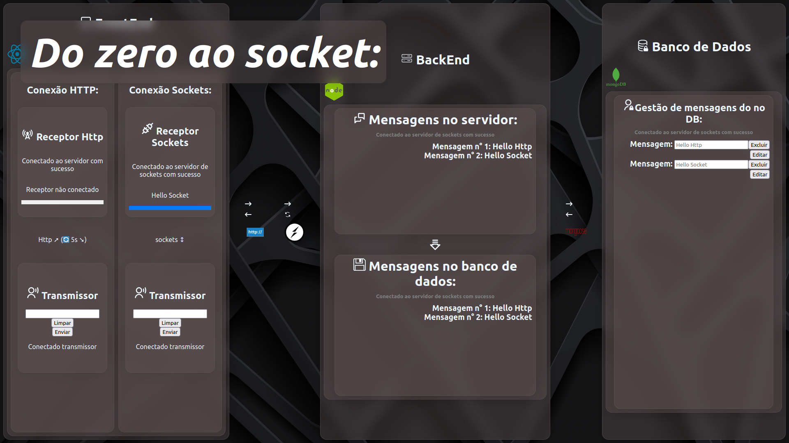
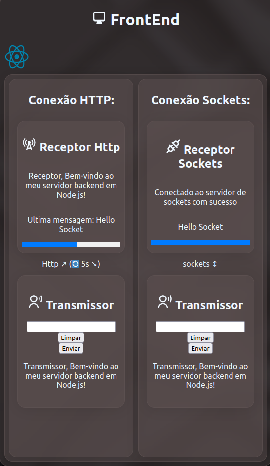
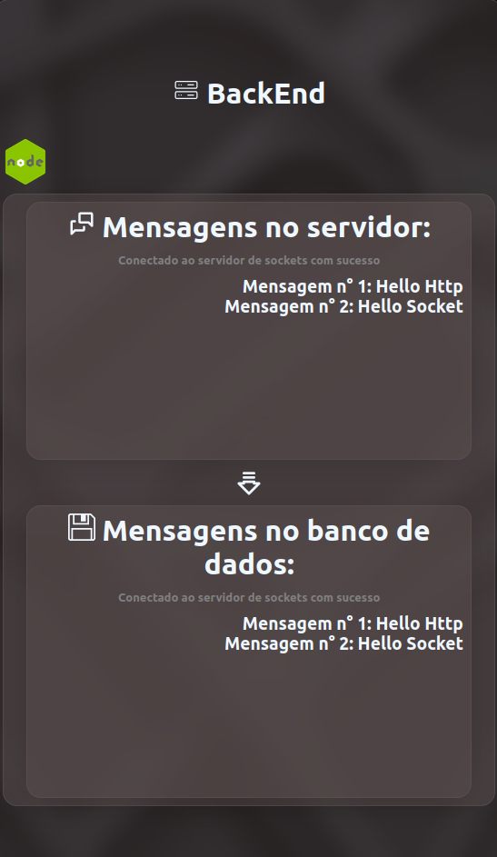
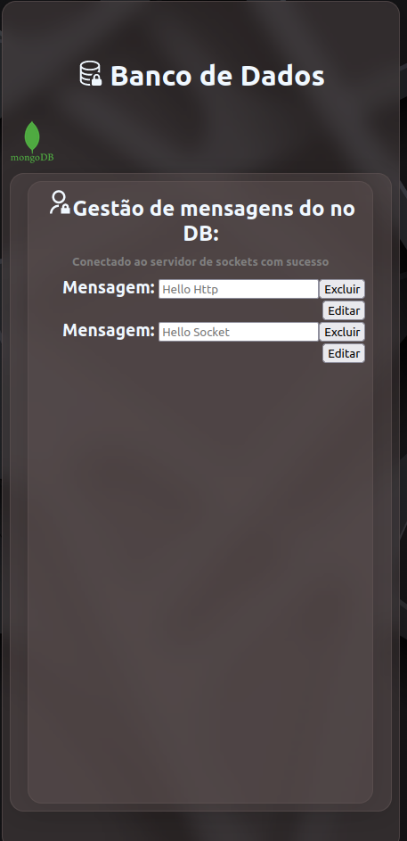

# SocketApp: Conceitos de Conectividade

SocketApp é uma aplicação voltada para reforço de memória e revisão de conceitos de conectividade entre camadas de uma aplicação, com ênfase nas vantagens em relação ao protocolo HTTP. Oferece uma experiência de aprendizado dinâmica e interativa, com velocidade de feedback e categorização eficiente.[To montando uma apresentação aqui](https://docs.google.com/presentation/d/e/2PACX-1vTuac2iflk5Qonmn9wfxgm7TSCjp1u1ry-bHRUVHOvgWP4H4Y6hKX1T8AM9J3xP5IZ5U4aBjAfCvEf_/pub?start=true&loop=false&delayms=10000#slide=id.g1f100cf0cb0_0_373)

## Funcionalidades

- Reforço de memória e revisão de conceitos de conectividade.
- Feedback rápido e categorizado para melhor assimilação do conteúdo.
- Integração de tecnologias avançadas para proporcionar uma experiência de aprendizado eficaz.

## Tecnologias Utilizadas

- Node.js
- React
- Socket.IO
- MongoDB

## Requisitos

Antes de começar, certifique-se de ter as seguintes tecnologias instaladas em seu sistema:

- Node.js: [Download Node.js](https://nodejs.org/)
- MongoDB: [Download MongoDB](https://www.mongodb.com/)

## Instalação e Execução

Siga estes passos para instalar e executar o SocketApp:
 
1. Clone o repositório: 'git clone https://github.com/seu-usuario/socketapp.git'
2. Navegue até o diretório do backend: 'cd socketapp/backend'
3. Instale as dependências: 'npm install'
4. Inicie o servidor backend: 'npm start'
5. Em outra janela do terminal, navegue até o diretório do frontend: 'cd ../frontend'
6. Instale as dependências do frontend: 'npm install'
7. Inicie o servidor de desenvolvimento frontend: 'npm start'

após isso pode executar com o comando 'npm run fullapp'

8. O SocketApp estará disponível em [http://localhost:4000](http://localhost:4000).

## Capturas de Tela

## Contribuindo

Contribuições são bem-vindas! Se você encontrar algum bug ou tiver sugestões de melhorias, abra uma issue ou envie um pull request.

## Licença

Este projeto é licenciado sob a Licença MIT.
